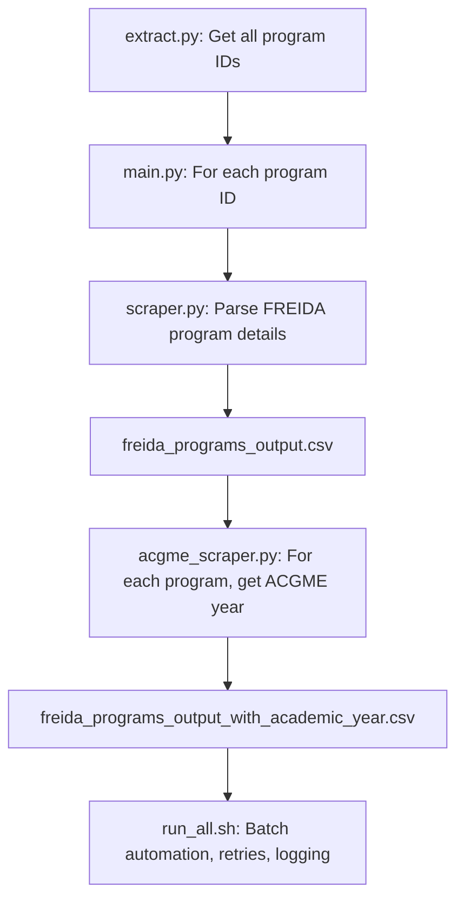
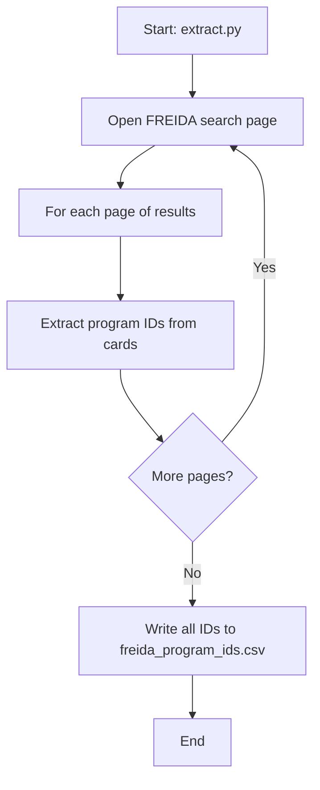
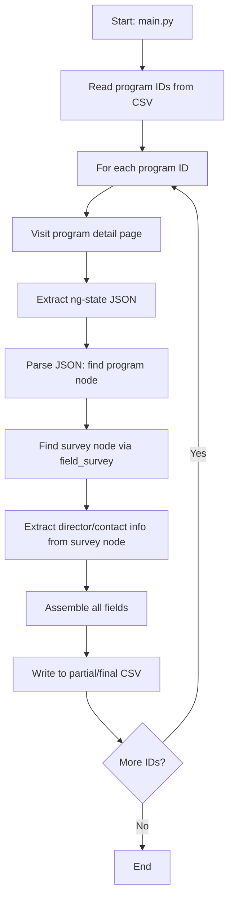
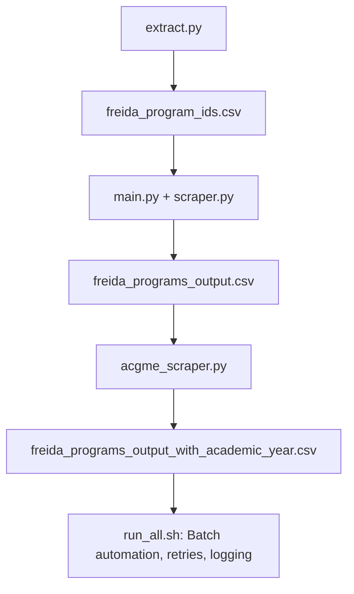

# FREIDA & ACGME Web Scraper Suite

This project automates the extraction of detailed residency/fellowship program data from the FREIDA (AMA) and ACGME websites. It uses Playwright for browser automation, BeautifulSoup for HTML parsing, and pandas for data management. The suite is modular, robust, and designed for large-scale, reliable scraping with full session management and error handling.

[](https://www.python.org/)
[](https://playwright.dev/python/)
[](LICENSE)

---

## Features
- Automated login/session management (Playwright)
- Batch scraping of all FREIDA program IDs
- Robust extraction of all program details (including director/contact info)
- Automated ACGME accreditation year extraction with OCR fallback
- Modular, checkpointed, and resumable pipeline
- Batch automation and failure recovery

---

## Requirements
```bash
pip install -r requirements.txt
playwright install
```

---

## Architecture Overview



---

## 1. Program ID Extraction (extract.py)

**Purpose:** Scrape all FREIDA program IDs for a given specialty.



- **Input:** None (scrapes all pages for a specialty)
- **Output:** `freida_program_ids.csv`

---

## 2. FREIDA Program Parsing (main.py + scraper.py)

**Purpose:** For each program ID, extract all available details, including director/contact info, using robust JSON parsing.



- **Input:** `freida_program_ids.csv`
- **Output:** `freida_programs_output.csv`

---

## 3. ACGME Accreditation Parsing (acgme_scraper.py)

**Purpose:** For each program, extract the first ACGME-accredited year using robust navigation and OCR fallback.

```mermaid
flowchart TD
    A[Start: acgme_scraper.py] --> B[Read program list (with/without year)]
    B --> C[For each program ID]
    C --> D[Search ACGME site]
    D --> E[Try to click 'View Accreditation History']
    E --> F{Click success?}
    F -- Yes --> G[Extract year from table]
    F -- No --> H[Take screenshot, run OCR]
    H --> I{OCR finds year?}
    I -- Yes --> J[Write to CSV]
    I -- No --> K[Try other click fallbacks]
    K --> L{Fallback success?}
    L -- Yes --> G
    L -- No --> M[Log as failed]
    G --> N{More IDs?}
    N -- Yes --> C
    N -- No --> O[Write final CSVs: success & failed]
    O --> P[End]
```

- **Input:** `freida_programs_output.csv` (or failed/success CSVs)
- **Output:** `freida_programs_output_with_academic_year.csv`, `freida_programs_output_success.csv`, `freida_programs_output_failed.csv`

---

## 4. Modular Pipeline & Automation (run_all.sh)

**Purpose:** Orchestrate the full pipeline, handle batching, retries, and logging.



- **Input:** None (runs the full pipeline)
- **Output:** All final CSVs, logs, and debug files

---

## Improvements & Best Practices
- **Robust JSON parsing:** Always finds the correct node structure, even if the schema changes.
- **Director/contact extraction:** Always uses the survey node for these fields, never the program node directly.
- **Batching & checkpointing:** Saves progress every 25 records, can resume from any point.
- **Failure handling:** All failures are logged and retried automatically.
- **Debugging:** Screenshots and HTML are saved for all failures/edge cases.
- **Output file management:** Success/failed/final CSVs are always kept in sync.
- **Safe to interrupt/resume:** Already-processed records are always skipped.
- **Logs and debug files:** Always excluded from git.

---

## Commit History (Summary)

- **Initial commits:** Playwright login/session, basic scraping, and .env support
- **Program extraction:** Added extract.py, program_extract.py, and robust ID scraping
- **Robust parsing:** Added JSON heuristics, robust survey/director/contact extraction
- **Modularization:** Split into main.py, scraper.py, utils.py for maintainability
- **Batching & automation:** Added run_all.sh, batch processing, and checkpointing
- **ACGME scraping:** Added acgme_scraper.py with robust navigation and OCR fallback
- **Output management:** Always split into success/failed/final CSVs, with fix_csv.py utility
- **Documentation:** Full markdown README, mermaid diagrams, and usage examples
- **Debugging:** All failures save screenshots/HTML for review
- **Recent:** Improved batch loop, robust file management, and automation script

---

## Usage

1. **Extract all program IDs:**
   ```bash
   python3 extract.py
   # Output: freida_program_ids.csv
   ```
2. **Extract all program details:**
   ```bash
   python3 main.py
   # Output: freida_programs_output.csv
   ```
3. **Extract ACGME accreditation years:**
   ```bash
   python3 acgme_scraper.py
   # Output: freida_programs_output_with_academic_year.csv, ..._success.csv, ..._failed.csv
   ```
4. **Automate full pipeline:**
   ```bash
   ./run_all.sh
   # Handles batching, retries, and logging
   ```

---

## License
MIT

