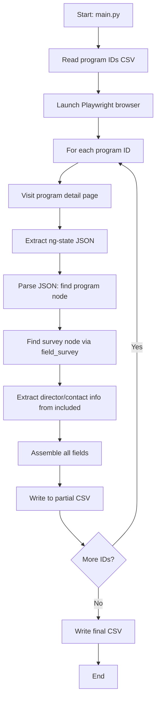

# 🔐 Web Scraper - Playwright Login & Session Automation

This project logs into a website using credentials stored in a `.env` file, saves the session cookies, and reloads the session later to explore authenticated pages.

[](https://www.python.org/)
[](https://playwright.dev/python/)
[](LICENSE)

---

## 📦 Features

- Logs in with username & password (from `.env`)
- Saves session cookies to file
- Reloads session without re-logging
- Discovers and prints all links on authenticated pages
- Works with JavaScript-heavy pages (via Playwright)

---

## 🧪 Test Site Used

> Default:  
**URL**: [https://the-internet.herokuapp.com/login](https://the-internet.herokuapp.com/login)  
**Username**: `tomsmith`  
**Password**: `SuperSecretPassword!`

---

## ⚙️ Requirements

```bash
pip install -r requirements.txt
playwright install


```

## Architecture & Flow Chart



## Output Files

- `freida_programs_output_with_academic_year.csv`: Main output, all records with updated academic year field.
- `freida_programs_output_success.csv`: All records with a valid academic year (successes).
- `freida_programs_output_failed.csv`: All records still missing an academic year (failures).

## acgme_scraper.py Usage

### Command Line Flags

- `--failed-only` : Only process records with missing academic year in output CSV (`freida_programs_output_failed.csv`).
- `--failed-record <ids>` : Comma-separated list of program_ids to retry from failed output CSV (e.g., `--failed-record 1405621446,1400500932`). Overrides `--failed-only` if set.

### Examples

- Process all failed records:
  ```bash
  python3 acgme_scraper.py --failed-only
  ```
- Process specific failed records:
  ```bash
  python3 acgme_scraper.py --failed-record 1405621446,1400500932
  ```

## 🛠️ Utility: Fixing the Main CSV

If you ever restore or modify your main CSV and it is missing the `acgme_first_academic_year` column, use the provided `fix_csv.py` script:

```bash
python3 fix_csv.py
```

This will add the column as the first column (with empty values) if missing, ensuring the scraper runs without errors.

## Updated Flow Chart

```mermaid
flowchart TD
    A[Start: main.py/acgme_scraper.py] --> B[Read program IDs from CSV]
    B --> C[Launch Playwright browser]
    C --> D[For each program ID (all, failed, or specific)]
    D --> E[Visit program detail page]
    E --> F[Try to click 'View Accreditation History' (human-like)]
    F --> G{Click success?}
    G -- Yes --> H[Extract academic year from table]
    G -- No --> I[Take screenshot, run OCR]
    I --> J{OCR finds valid year?}
    J -- Yes --> K[Write to main CSV]
    J -- No --> L[Try other click fallbacks]
    L --> M{Fallback success?}
    M -- Yes --> H
    M -- No --> N[Log as failed]
    H --> O{Valid year found?}
    O -- Yes --> K
    O -- No --> I
    K --> P{More IDs?}
    P -- Yes --> D
    P -- No --> Q[Write final CSVs: success & failed]
    Q --> R[End]
```

## Automation: Process All Records in Batches

To process all 600+ records efficiently, use the provided automation script:

### `run_all.sh`

- **What it does:**
  - Runs the scraper in batches of 5, skipping already completed records.
  - When only a few failures remain, it processes each failed record one at a time using the `--failed-record` flag.
  - Continues until all records are completed and all failures are resolved.
  - Prints progress after each batch and after each individual retry.

### Usage

```bash
./run_all.sh
```

- You can safely interrupt and resume the script; it will always skip already-completed records.
- The script prints progress and will not stop until all records are processed.
- All output and debug files are managed as described above.

## Commit History & File Management

- All output CSVs are always overwritten, never appended, to reflect the current state.
- Debug screenshots and logs are saved in their respective directories and excluded from git.
- The `fix_csv.py` utility is provided for quick repair of the main CSV structure if needed.

## Nuances & Best Practices

- **Batch Size:** By default, the script processes 5 random records per run (can be changed in the code). This helps avoid overloading the site and makes debugging easier.
- **Skipping Already Collected Records:** The script always skips records that already have an academic year, ensuring no duplicate work or overwriting of good data.
- **Navigation & OCR Robustness:**
  - If clicking 'View Accreditation History' fails, a screenshot is taken and OCR is attempted immediately.
  - The OCR logic will skip '-' and use the next valid academic year found in the image.
  - If OCR fails, the script tries other click fallbacks and logs as failed only if all options are exhausted.
- **Output File Management:**
  - `freida_programs_output_success.csv`: All records with a valid academic year (successes).
  - `freida_programs_output_failed.csv`: All records still missing an academic year (failures).
  - `freida_programs_output_with_academic_year.csv`: Main output, all records with updated academic year field.
  - After each run, these files are kept in sync: successful records are moved from failed to success, and vice versa if needed.
- **Processing Failed Records:**
  - Use `--failed-only` to process all failed records in batch.
  - Use `--failed-record <id>` to process a specific failed record.
  - To process all failed records one at a time, loop over the IDs and call the script with `--failed-record` for each.
- **Debugging:**
  - Debug screenshots and HTML are saved for failed or edge cases.
  - OCR fallback is used if DOM extraction fails, and now robustly skips '-' rows.
- **Usage Tips:**
  - For large datasets, run the script multiple times to gradually fill in missing data.
  - You can safely interrupt and resume scraping; already-scraped records will be skipped.
  - All logs should be stored in the `logs/` directory (excluded from git).

